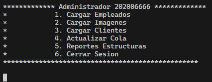
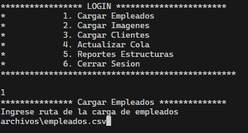
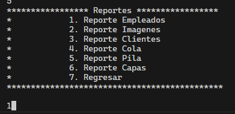
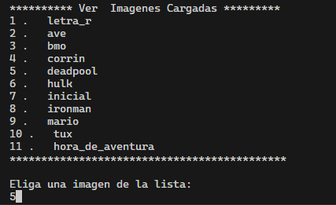
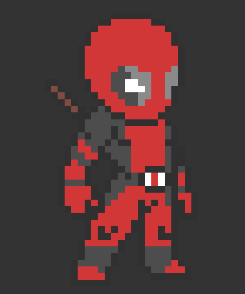

# MANUAL DE USUARIO

La empresa EDD Creative, desea que usted como programador realice una aplicación de escritorio capaz de generar imágenes en píxeles, esto debido a que imágenes con extensiones generales como jpg, png, svg, llegan a tener un peso grande en almacenamientos de la nube, por lo cual se opta a generar imágenes creadas por intérpretes de html y css, ya que al ser generadas como código, optimizan el espacio que estos ocupan.

## **Uso de la aplicación**

Para esto es necesario que se tengo instalado previamente Golang  y graphviz en el ordenador que se ejecutará la aplicación.
Al verrificar que si tenga instalado Go, es necesario ubicarse por medio de la termnial en la ruta donde se encuentra el archivo **main.go** . 
``` Go
     // Al estar en la termnial se ingresará el siguiente comando 

     go run main.go
```
Al iniciar la aplicacion aparecerá el siguiente menú 


Por medio de l cual se podrá iniciar sesión ingresando con el usuario "ADMIN_202006666" y la contraseña "admin"

Al ingresar dichas credenciales podremos acceder al menú del administrador 


En este menú podremos subir los empleados, las imagenes, los clientes, la cola de clientes por medio de un archivo tipo **CSV**, solo es necesario agregar la ruta relativa del archivo para poder realizar la carga masiva


También podremos generar reportes por medio de otro menú al cual podremos acceder y se nos mostrará una grafica de las estructuras que ha almacenado los archivos.




Podremos iniciar sesión con los empleados que se ingresaron por medio del archivo CSV, solo necesitaremos regresar al menú principal e ingresal las credenciales correctas del empleado con el cual queremos iniciar la sesión


Al ingresar al menú de empleado podremos ver las imagenes cargadas y elegir una de ellas, al hacer esto se nos mostrará un archivo html con la imagen elegida.







También podremos atender a la cola de clientes ingresados


El cliente podrá escoger la imagen a su elección y será pasado a una pila de clientes atendidos, si algún cliente en la cola no se encontraba ingresado anteriormente se le generará un número de ID aleatorio y será almacenado como cliente nuevo.


# MANUAL TÉCNICO

###### LISTA ENLAZADA DOBLE

* Cada nodo tendrá dos apuntadores. Uno al nodo siguiente y el otro hacia
el nodo anterior.
* También es recomendable utilizar las instancias de cabecera y final de
lista.
* Tanto el apuntador anterior del primer nodo de la lista como el apuntador
siguiente del último nodo de la lista tendrán valor nulo.
``` Go

type ListaDoble struct {
	Inicio *NodoDoble
	Longitud int
}

func (l *ListaDoble) estaVacia() bool {
	return l.Longitud == 0
}


func (l *ListaDoble) Insertar(imagen *Imagen) {
	
	if l.estaVacia() {
		nuevoNodo := &NodoDoble{imagen, nil, nil}
		l.Inicio = (nuevoNodo)
		l.Longitud++
	} else {
		nuevoNodo := &NodoDoble{imagen, nil, nil}
		aux := l.Inicio
		for aux.siguiente != nil {
			aux = aux.siguiente
		}
		
		aux.siguiente = nuevoNodo
		aux.siguiente.anterior = aux
		l.Longitud++
	}
}
```
###### PILA
Una estructura de datos tipo pila permite agregar nodos a la pila y
eliminarlos de esta sólo desde su parte superior. Por esta razón, a una pila se le conoce como estructura de datos UEPS (último en entrar, primero en salir) o LIFO (Last-Input, FirstOutput).
``` Go
type Pila struct {
	Primero  *NodoPila
	Longitud int
}

func (c *Pila) ConstructorPila(primero *NodoPila, longitud int) {
	c.Primero = primero
	c.Longitud = longitud
}

func (p *Pila) estaVacia() bool {
	if p.Longitud == 0 {
		return true
	} else {
		return false
	}
}

func (p *Pila) Push(pedido *Pedido) {
	if p.estaVacia() {
		nuevoNodo := &NodoPila{pedido, nil}
		p.Primero = nuevoNodo
		p.Longitud++
	} else {
		nuevoNodo := &NodoPila{pedido, p.Primero}
		p.Primero = nuevoNodo
		p.Longitud++
	}
}
```
###### COLA
Los elementos se eliminan (se quitan) de la cola en el mismo orden en que se almacenan y, por consiguiente, una cola es una estructura de tipo FIFO
(first-in-first-out, primero en entrar Primero en salir o bien primero en
llegar/primero en ser servido). 

``` Go
type Cola struct{
	Primero *NodoCola
	Longitud int
}
func (c *Cola) ConstructorCola(primero *NodoCola, longitud int) {
	c.Primero = primero
	c.Longitud = longitud
}

func (c *Cola) estaVacia() bool {
	if c.Longitud == 0 {
		return true
	} else {
		return false
	}
}

func (c *Cola) Encolar(cliente *Cliente) {
	if c.estaVacia() {
		nuevoNodo := &NodoCola{cliente, nil}
		c.Primero = nuevoNodo
		c.Longitud++
	} else {
		nuevoNodo := &NodoCola{cliente, nil}
		aux := c.Primero
		for aux.siguiente != nil {
			aux = aux.siguiente
		}
		aux.siguiente = nuevoNodo
		c.Longitud++
	}
}

```
