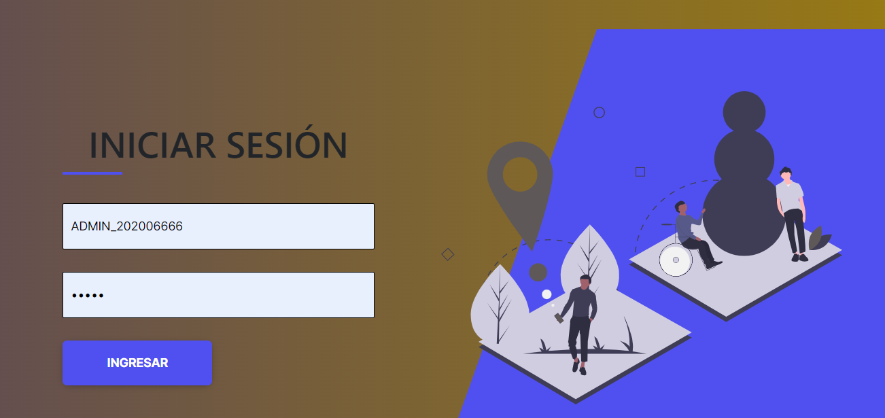
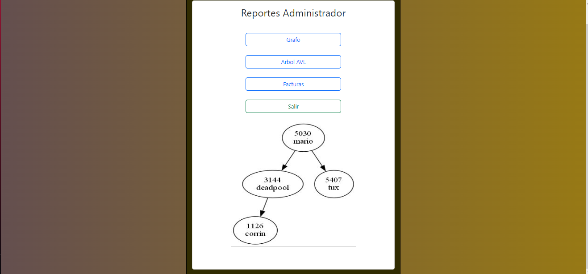
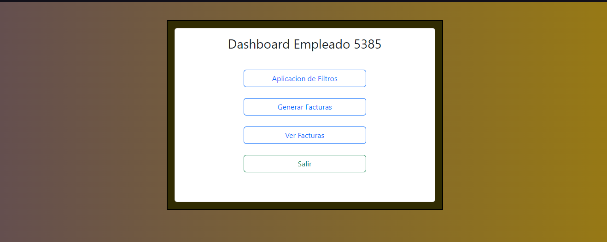
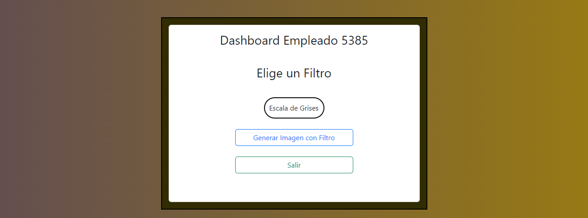
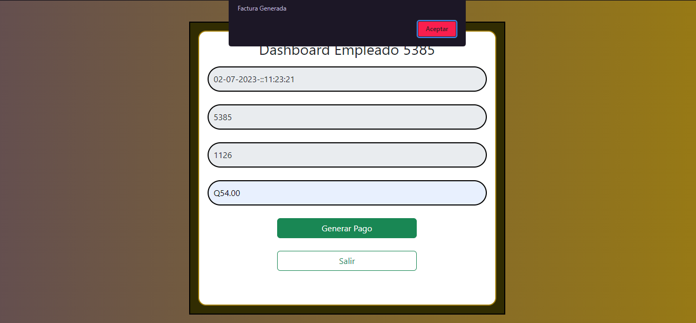
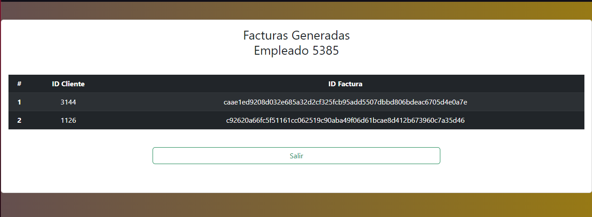

# MANUAL DE USUARIO

La empresa EDD Creative, luego del éxito de la aplicación en consola presentado
por usted como desarrollador, la empresa desea que la aplicación sea utilizada en
un entorno web, y desean que usted cree una aplicación web y un servidor para
poder almacenar y tener un ambiente más agradable para los usuarios como para
los empleados, para ello usted debe presentar un prototipo local de la aplicación
para considerar utilizarlo en servicios web. Se solicita que el sistema ya se incluya el
sistema de pagos para los clientes, y el sistema de filtros para las imágenes.


Al iniciar la aplicacion aparecerá el siguiente menú 

### Menú Admin
Por medio de l cual se podrá iniciar sesión ingresando con el usuario "ADMIN_202006666" y la contraseña "admin"




Al ingresar dichas credenciales podremos acceder al menú del administrador. EN este menú podremos hacer la carga de los pedidos por medio de un archivo "JSON" y la carga de em empleados con un archivo "CSV"


Tambien tendremos dos botones, uno de ellos nos permitirá deslogearnos de la cuenta admin y el otro nos permitirá ver los distintos reportes que se vayan generando.




### Menú Empleado
Al ingresar con alguna de las credenciales de los empleados podremos acceder al menú de empleado en el cual veremos lo siguiente:



Al ingresar a la opción de Aplicación de Filtros podremos ver que filtro deseamos aplicar a la imagen que el primer cliente de la cola desee aplicar.



Luego de escoger un filtro debemos generar la factura ingresando el monto total a cobrar.



Por último tendremos un menú donde podremos ver todas las facturas generadas.




# MANUAL TÉCNICO

##### COLA
Los elementos se eliminan (se quitan) de la cola en el mismo orden en que se almacenan y, por consiguiente, una cola es una estructura de tipo FIFO
(first-in-first-out, primero en entrar Primero en salir o bien primero en
llegar/primero en ser servido). 

``` Go
type Cola struct {
	Primero  *NodoCola
	Longitud int
}

func (c *Cola) Encolar(idCliente int, nombreimagen string) {
	nuevoPedido := &PedidoCola{Id_Cliente: idCliente, Nombre_Imagen: nombreimagen}
	if c.Longitud == 0 {
		nuevoNodo := &NodoCola{nuevoPedido, nil}
		c.Primero = nuevoNodo
		c.Longitud++
	} else {
		nuevoNodo := &NodoCola{nuevoPedido, nil}
		aux := c.Primero
		for aux.Siguiente != nil {
			aux = aux.Siguiente
		}
		aux.Siguiente = nuevoNodo
		c.Longitud++
	}
}

func (c *Cola) Descolar() {
	if c.Longitud == 0 {
		fmt.Println("No hay pedidos pendientes en la cola")
	} else {
		c.Primero = c.Primero.Siguiente
		c.Longitud--
	}
}

```

##### Block Chain 

Un blockchain es una estructura de datos en la cual la información se agrupa en diversos conjuntos (estos conjuntos se denominan bloques) que contienen información relativa a otro bloque de la cadena anterior en una línea temporal.

``` Go
type BlockChain struct {
	Inicio          *NodoBloque
	Bloques_Creados int
}

func (b *BlockChain) InsertarBloque(fecha string, biller string, customer string, payment string) {
	cadenaFuncion := strconv.Itoa(b.Bloques_Creados) + fecha + biller + customer + payment
	hash := SHA256(cadenaFuncion)
	if b.Bloques_Creados == 0 {
		datosBloque := map[string]string{
			"index":        strconv.Itoa(b.Bloques_Creados),
			"timestamp":    fecha,
			"biller":       biller,
			"customer":     customer,
			"payment":      payment,
			"previoushash": "0000",
			"hash":         hash,
		}
		nuevoBloque := &NodoBloque{Bloque: datosBloque}
		b.Inicio = nuevoBloque
	} else {
		aux := b.Inicio
		for aux.Siguiente != nil {
			aux = aux.Siguiente
		}
		datosBloque := map[string]string{
			"index":        strconv.Itoa(b.Bloques_Creados),
			"timestamp":    fecha,
			"biller":       biller,
			"customer":     customer,
			"payment":      payment,
			"previoushash": aux.Bloque["hash"],
			"hash":         hash,
		}
		nuevoBloque := &NodoBloque{Bloque: datosBloque, Anterior: aux}
		aux.Siguiente = nuevoBloque
	}
	b.Bloques_Creados++
}

func SHA256(cadena string) string {
	hexaString := ""
	h := sha256.New()
	h.Write([]byte(cadena))
	hash := h.Sum(nil)
	hexaString = hex.EncodeToString(hash)
	return hexaString
}

func (b *BlockChain) InsertarTabla(tabla *TablaHash.TablaHash, idEmpleado string) {
	aux := b.Inicio
	for aux != nil {
		if aux.Bloque["biller"] == idEmpleado {
			tabla.Insertar(aux.Bloque["customer"], aux.Bloque["hash"])
		}
		aux = aux.Siguiente
	}
}


```


##### Tabla Hash 

Una tabla hash o mapa hash es una estructura de datos que asocia llaves o claves con valores. La operación principal que soporta de manera eficiente es la búsqueda: permite el acceso a los elementos (teléfono y dirección, por ejemplo) almacenados a partir de una clave generada usando el nombre, número de cuenta o id.


``` Go
type TablaHash struct {
	Tabla       [30]NodoHash
	Capacidad   int // 5
	Utilizacion int // 0.0
}

func (t *TablaHash) calculoIndice(id_cliente int, multiplicador int) int {
	/*índice = (45*1526 + 202312345) % tamaño_tablahash*/
	indice := (18*id_cliente + 201700918*multiplicador) % t.Capacidad
	return indice
}

func (t *TablaHash) capacidad_Tabla() {
	auxCap := float64(t.Capacidad) * 0.6
	if t.Utilizacion > int(auxCap) {
		t.Capacidad = t.nuevaCapacidad()
		t.Utilizacion = 0
		t.reInsertar()
	}
}

func (t *TablaHash) reInsertar() {
	auxTabla := t.Tabla
	t.NewTablaHash()
	for i := 0; i < 30; i++ {
		if auxTabla[i].Llave != -1 {
			fmt.Println(auxTabla[i].Id_Cliente)
			t.Insertar(auxTabla[i].Id_Cliente, auxTabla[i].Id_Factura)
		}
	}
}

func (t *TablaHash) NewTablaHash() {
	for i := 0; i < 30; i++ {
		t.Tabla[i].Llave = -1
		t.Tabla[i].Id_Cliente = ""
		t.Tabla[i].Id_Factura = ""
	}
}

func (t *TablaHash) nuevaCapacidad() int {
	numero := t.Capacidad + 1
	for !t.isPrime(numero) {
		numero++
	}
	return numero
}

func (t *TablaHash) isPrime(numero int) bool {
	if numero <= 1 {
		return false
	}
	if numero == 2 {
		return true
	}
	if numero%2 == 0 {
		return false
	}
	for i := 3; i <= int(math.Sqrt(float64(numero))); i += 2 {
		if (numero % i) == 0 {
			return false
		}
	}
	return true
}

func (t *TablaHash) Insertar(id_cliente string, id_factura string) {
	numVar, _ := strconv.Atoi(id_cliente)
	indice := t.calculoIndice(numVar, 1)
	nuevoNodo := &NodoHash{Llave: indice, Id_Cliente: id_cliente, Id_Factura: id_factura}
	if indice < t.Capacidad {
		if t.Tabla[indice].Llave == -1 {
			t.Tabla[indice] = *nuevoNodo
			t.Utilizacion++
			t.capacidad_Tabla()
		} else {
			indice = t.calculoIndice(numVar, 2)
			if t.Tabla[indice].Llave == -1 {
				nuevoNodo.Llave = indice
				t.Tabla[indice] = *nuevoNodo
				t.Utilizacion++
				t.capacidad_Tabla()
				return
			}
			for i := indice; i < t.Capacidad; i++ {
				if t.Tabla[i].Llave == -1 {
					nuevoNodo.Llave = i
					t.Tabla[i] = *nuevoNodo
					t.Utilizacion++
					t.capacidad_Tabla()
					return
				}
			}
		}
	}
}

``` 

##### Arbol AVl

Un árbol AVL es un árbol binario de búsqueda, eso quiere decir que está estructurado a través de nodos donde el subárbol izquierdo cumple con que todos los nodos son menores que la raíz, y el subárbol derecho cumple con que todos los nodos son mayores a la raíz.

``` Go
     type Arbol struct {
	Raiz *NodoArbol
}

func (a *Arbol) altura(raiz *NodoArbol) int {
	if raiz == nil {
		return 0
	}
	return raiz.Altura
}

func (a *Arbol) equilibrio(raiz *NodoArbol) int {
	if raiz == nil {
		return 0
	}
	return (a.altura(raiz.Derecho) - a.altura(raiz.Izquierdo))
}

func (a *Arbol) InsertarElemento(id_cliente int, nombre_imagen string) {
	nuevoNodo := &NodoArbol{Valor: &Peticiones.Pedido{Id_Cliente: id_cliente, Nombre_Imagen: nombre_imagen}}
	a.Raiz = a.insertarNodo(a.Raiz, nuevoNodo)
}

func (a *Arbol) rotacionI(raiz *NodoArbol) *NodoArbol {
	raiz_derecho := raiz.Derecho
	hijo_izquierdo := raiz_derecho.Izquierdo
	raiz_derecho.Izquierdo = raiz
	raiz.Derecho = hijo_izquierdo
	numeroMax := math.Max(float64(a.altura(raiz.Izquierdo)), float64(a.altura(raiz.Derecho)))
	raiz.Altura = 1 + int(numeroMax)
	numeroMax = math.Max(float64(a.altura(raiz_derecho.Izquierdo)), float64(a.altura(raiz_derecho.Derecho)))
	raiz_derecho.Altura = 1 + int(numeroMax)
	raiz.Factor_Equilibrio = a.equilibrio(raiz)
	raiz_derecho.Factor_Equilibrio = a.equilibrio(raiz_derecho)
	return raiz_derecho
}

func (a *Arbol) rotacionD(raiz *NodoArbol) *NodoArbol {
	raiz_izquierdo := raiz.Izquierdo
	hijo_derecho := raiz_izquierdo.Derecho
	raiz_izquierdo.Derecho = raiz
	raiz.Izquierdo = hijo_derecho
	numeroMax := math.Max(float64(a.altura(raiz.Izquierdo)), float64(a.altura(raiz.Derecho)))
	raiz.Altura = 1 + int(numeroMax)
	numeroMax = math.Max(float64(a.altura(raiz_izquierdo.Izquierdo)), float64(a.altura(raiz_izquierdo.Derecho)))
	raiz_izquierdo.Altura = 1 + int(numeroMax)
	raiz.Factor_Equilibrio = a.equilibrio(raiz)
	raiz_izquierdo.Factor_Equilibrio = a.equilibrio(raiz_izquierdo)
	return raiz_izquierdo
}

func (a *Arbol) insertarNodo(raiz *NodoArbol, nuevoNodo *NodoArbol) *NodoArbol {
	if raiz == nil {
		raiz = nuevoNodo
	} else {
		if raiz.Valor.Id_Cliente > nuevoNodo.Valor.Id_Cliente {
			raiz.Izquierdo = a.insertarNodo(raiz.Izquierdo, nuevoNodo)
		} else {
			raiz.Derecho = a.insertarNodo(raiz.Derecho, nuevoNodo)
		}
	}
	numeroMax := math.Max(float64(a.altura(raiz.Izquierdo)), float64(a.altura(raiz.Derecho)))
	raiz.Altura = 1 + int(numeroMax)
	balanceo := a.equilibrio(raiz)
	raiz.Factor_Equilibrio = balanceo
	/*Rotacion simple a la izquierda*/
	if balanceo > 1 && nuevoNodo.Valor.Id_Cliente > raiz.Derecho.Valor.Id_Cliente {
		return a.rotacionI(raiz)
	}
	if balanceo < -1 && nuevoNodo.Valor.Id_Cliente < raiz.Izquierdo.Valor.Id_Cliente {
		return a.rotacionD(raiz)
	}
	if balanceo > 1 && nuevoNodo.Valor.Id_Cliente < raiz.Derecho.Valor.Id_Cliente {
		raiz.Derecho = a.rotacionD(raiz.Derecho)
		return a.rotacionI(raiz)
	}
	if balanceo < -1 && nuevoNodo.Valor.Id_Cliente > raiz.Izquierdo.Valor.Id_Cliente {
		raiz.Izquierdo = a.rotacionI(raiz.Izquierdo)
		return a.rotacionD(raiz)
	}
	return raiz
}

```


##### Grafo No Dirigido

Los grafos son estructuras de datos, es decir, tipos de datos abstractos, comúnmente los grafos son utilizados para el modelado de problemas. Un grafo es un conjunto no vacıo de objetos o entes fısicos que tienen relación entre ellos.Un grafo dirigido o digrafo es un tipo de grafo en el cual las aristas tienen un sentido definido,​ a diferencia del grafo no dirigido, en el cual las aristas son relaciones simétricas y no apuntan en ningún sentido.

``` Go
    type Grafo struct {
	Principal *NodoMatrizDeAdyacencia
}


func (g *Grafo) insertarC(padre string, hijo string, filtro string) { // cliente, imagen
	nuevoNodo := &NodoMatrizDeAdyacencia{Valor: hijo}
	if g.Principal != nil && padre == g.Principal.Valor {
		aux := g.Principal
		for aux.Siguiente != nil {
			aux = aux.Siguiente
		}
		aux.Siguiente = nuevoNodo
	} else {
		g.insertarF(padre)
		aux := g.Principal
		for aux != nil {
			if aux.Valor == padre {
				break
			}
			aux = aux.Abajo
		}
		if aux != nil {
			nuevoNodo.Siguiente = &NodoMatrizDeAdyacencia{Valor: filtro}
			aux.Siguiente = nuevoNodo
		}
	}
}

func (g *Grafo) insertarF(padre string) {
	nuevoNodo := &NodoMatrizDeAdyacencia{Valor: padre}
	if g.Principal == nil {
		g.Principal = nuevoNodo
	} else {
		aux := g.Principal
		for aux.Abajo != nil {
			if aux.Valor == padre {
				return
			}
			aux = aux.Abajo
		}
		aux.Abajo = nuevoNodo
	}
}


func (g *Grafo) InsertarValores(padre string, cliente string, imagen string, filtros string) {
	if g.Principal == nil {
		g.insertarF(padre)
		g.insertarC(padre, cliente, "")
		g.insertarC(cliente, imagen, filtros)
	} else {
		g.insertarC(padre, cliente, "")
		g.insertarC(cliente, imagen, filtros)
	}
}

```